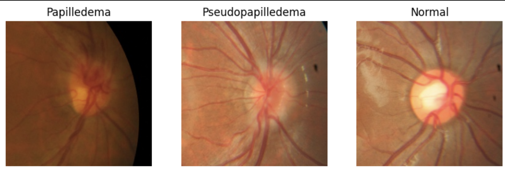
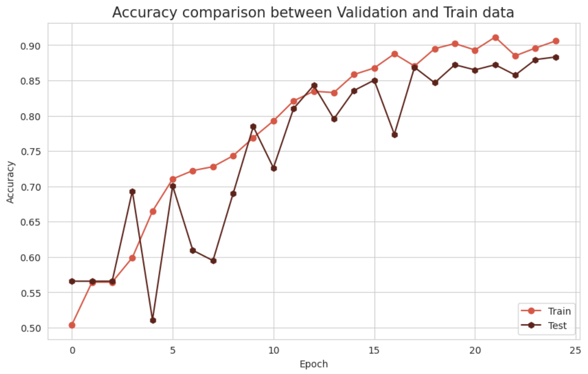
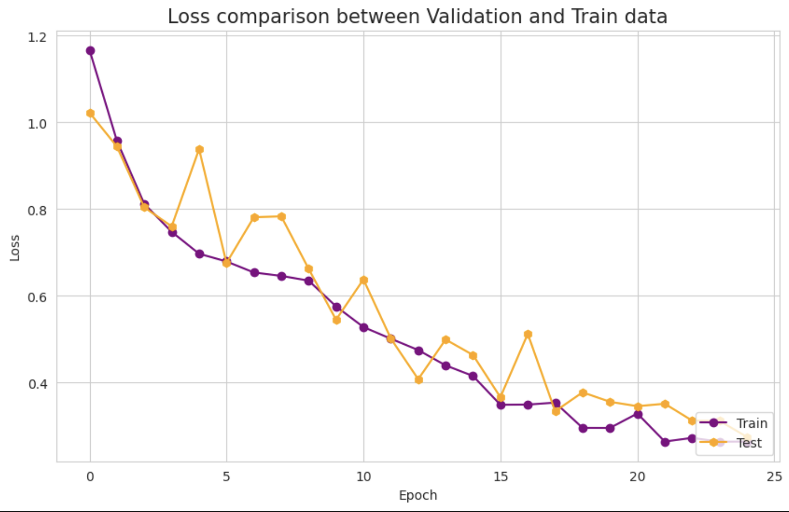
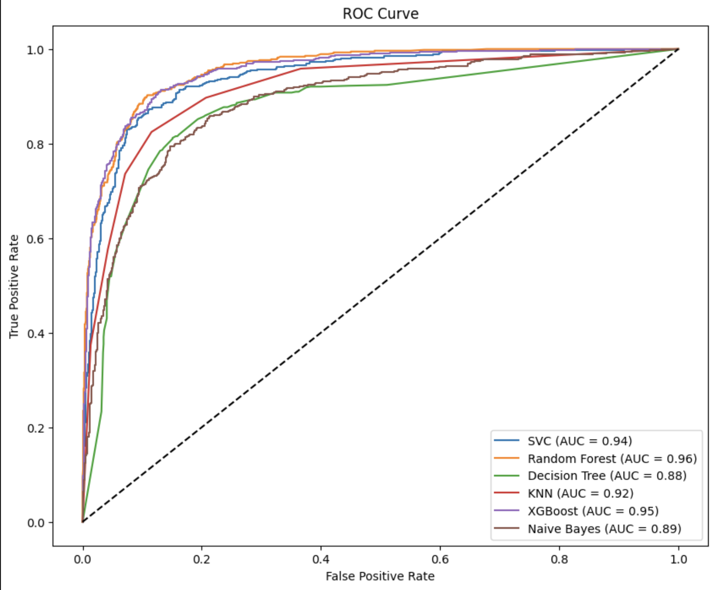
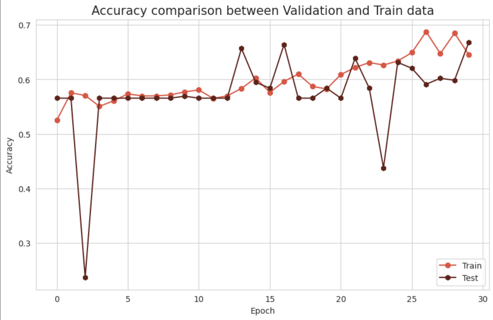
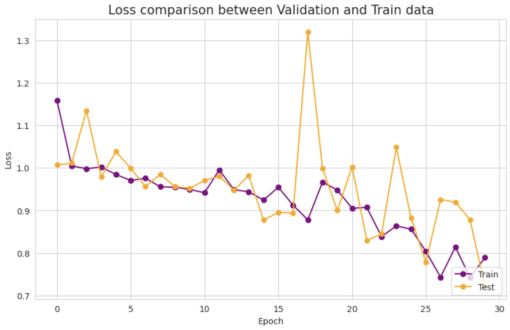
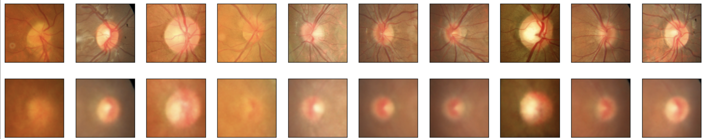
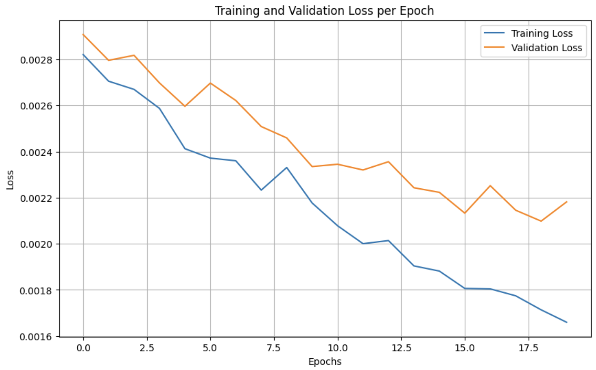
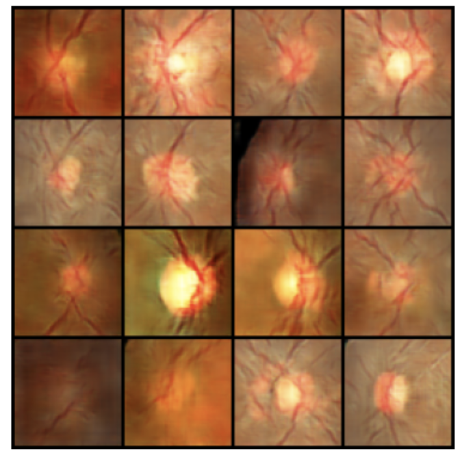
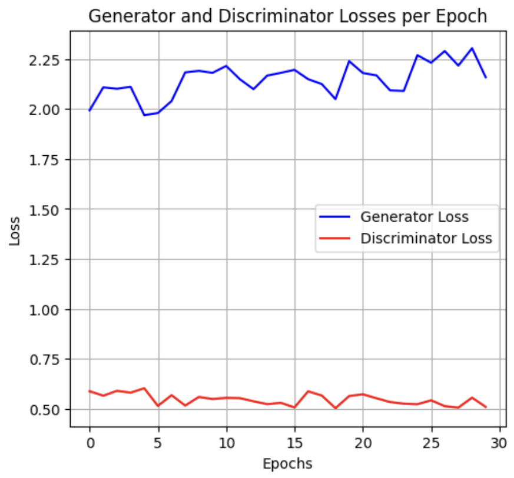

# Deep Learning Projects — Medical Image Analysis

A collection of deep learning projects focused on **medical image classification, transfer learning, deep feature extraction, image reconstruction, and generative modeling** using fundus images.

The projects use the same dataset throughout and explore several complementary approaches to understanding and modeling ophthalmic images.

---

## Dataset

The dataset contains **1,369 fundus images** across three classes:

- **Normal**
- **Papilledema**
- **Pseudopapilledema**

The dataset was obtained from the following sources:

- OSF: https://osf.io/2w5ce/overview
- OpenMedLab dataset documentation: https://github.com/openmedlab/Awesome-Medical-Dataset/blob/main/resources/Papilledema.md

For the supervised classification experiments, the dataset is split into training and test sets, with class balancing and image augmentation applied where appropriate.

### Dataset Samples

---

# Projects

## 1. CNN Image Classification

**Notebook:** `cnn-image-classification.ipynb`

A custom Convolutional Neural Network developed for three-class fundus image classification.

### Workflow

- Image loading and preprocessing
- Image normalization
- Train/test split
- Class distribution analysis
- Class balancing using image augmentation
- CNN architecture design
- Model training
- Training and validation monitoring

The original dataset contains an imbalanced class distribution. The training data was balanced through augmentation before model training.

The CNN contains multiple convolutional and pooling blocks followed by dropout and fully connected layers for classification.

### Results

The model reaches approximately:

- **91% training accuracy**
- **88% test accuracy**

Training and validation behavior is shown below.

### Accuracy

### Loss

---

## 2. ResNet50 Feature Extraction + Machine Learning

**Notebook:** `resnet50-feature-extraction.ipynb`

This project uses **ImageNet-pretrained ResNet50** as a deep feature extractor rather than training a CNN classifier directly.

The extracted image representations are converted into a tabular feature space and subsequently evaluated using several classical machine learning algorithms.

### Workflow

- Image preprocessing and normalization
- ResNet50 initialization with ImageNet weights
- Deep feature extraction
- Feature representation with 2,048-dimensional ResNet50 features
- Feature selection
- Outlier handling
- Duplicate checking
- Class balancing
- Train/test split
- Feature scaling
- Classical machine learning

### Machine Learning Models

The extracted features are evaluated using:

- K-Nearest Neighbors (KNN)
- Support Vector Machine (SVM/SVC)
- Decision Tree
- Random Forest
- XGBoost
- Gaussian Naive Bayes

Hyperparameter optimization is also performed for several models.

### Evaluation

The models are evaluated using classification metrics and ROC curves.

The ROC analysis reports AUC values for the evaluated models, with the plotted results ranging from approximately **0.88 to 0.96**.

### ROC Curves

This project demonstrates a hybrid workflow combining **deep representation learning with classical machine learning**.

---

## 3. ResNet50 Transfer Learning

**Notebook:** `resnet50-transfer-learning.ipynb`

A transfer learning approach using **ResNet50 pretrained on ImageNet** as the convolutional backbone.

Instead of training the entire network from scratch, the pretrained ResNet50 layers are used as a feature representation and a custom classification head is added for the three target classes.

### Workflow

- Image preprocessing
- Normalization
- Train/test split
- Class distribution analysis
- Training-set balancing
- Image augmentation
- ImageNet-pretrained ResNet50
- Frozen convolutional backbone
- Custom classification head
- Model training
- Training/validation analysis

The resulting model contains approximately **23.9 million parameters**, with the pretrained ResNet50 backbone frozen and the task-specific classification layers trained for the target dataset.

### Training Results

The training curves are included to show the model's learning behavior and the relationship between training and validation performance across epochs.

---

## 4. Convolutional Autoencoder

**Notebook:** `convolutional-autoencoder.ipynb`

A convolutional autoencoder designed to learn compact image representations and reconstruct fundus images.

The architecture consists of an encoder that progressively reduces the spatial representation of the image and a decoder that reconstructs the original image.

### Architecture

The model includes:

- Convolutional layers
- Max-pooling layers
- Dense representation layers
- Reshaping
- Convolutional decoder layers
- Up-sampling layers
- Reconstruction output layer

The model is trained using **Mean Squared Error (MSE)** reconstruction loss.

### Training

The autoencoder is trained for 20 epochs on the fundus image dataset.

The training process reduces the reconstruction loss from approximately **0.0028** at the beginning of training to approximately **0.0017** near the end of training.

### Results

#### Original vs Reconstructed Images

#### Training and Validation Loss

This experiment focuses on **representation learning and image reconstruction** rather than supervised classification.

---

## 5. DCGAN Image Generation

**Notebook:** `dcgan-image-generation.ipynb`

A Deep Convolutional Generative Adversarial Network (DCGAN) developed to generate synthetic fundus images.

The model consists of two competing neural networks:

- **Generator** — generates synthetic fundus images from random noise
- **Discriminator** — attempts to distinguish real images from generated images

### Workflow

- Dataset loading
- Image preprocessing
- Batch preparation
- Generator architecture
- Discriminator architecture
- Combined GAN model
- Adversarial training
- Generator/discriminator loss monitoring
- Generated image visualization

The model is trained for **30 epochs** with image batches of 32 samples at a resolution of **64 × 64**.

The final recorded losses at epoch 30 are:

- **Discriminator Loss:** 0.6107
- **Generator Loss:** 1.5873

### Generated Images

### Generator and Discriminator Loss

This experiment explores **generative modeling of medical images** using adversarial training.

---
# Summary
This repository demonstrates several approaches to medical image analysis using a common fundus image dataset:

|Project	|Main Approach	|Primary Task|
|---|--|----------------|
|CNN Image Classification	|Custom CNN	|Image Classification|
|ResNet50 Feature Extraction	|ResNet50 + ML	|Deep Feature Extraction & Classification|
|ResNet50 Transfer Learning	|Pretrained ResNet50	|Image Classification|
|Convolutional Autoencoder	|Encoder–Decoder CNN	|Image Reconstruction|
|DCGAN	|Generator + Discriminator	|Image Generation|

Together, these projects cover different stages of a modern deep learning workflow, from **image preprocessing and supervised classification to transfer learning, deep feature engineering, representation learning, and generative modeling.**
